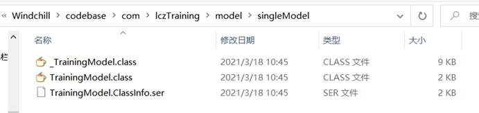
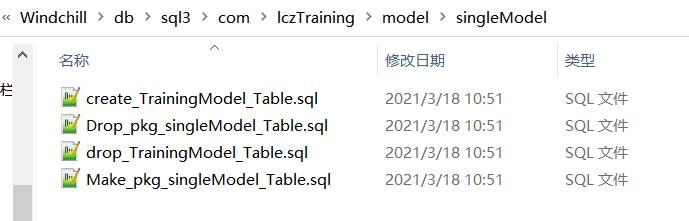

# 建模

## 一、简单模型

### 一、建模

用于数据的存储，代码的调用（增删改查）

具体建模查看类com.lczTraining.model.singleModel.TrainingModel

 

字段填写完成后，保存，然后将工程上的文件复制到虚拟机对应位置

Windchill\src\com\lczTraining\model\singleModel

然后在windchill shell下执行命令：

1．命令一：ant -f bin/tools.xml class -Dclass.includes=com/lczTraining/model/singleModel/TrainingModel.java

此命令执行完后:

1)    会在Windchill\src_gen\com\lczTraining\model\singleModel生成一个带下划线的一个java文件，将此文件复制到工程对应目录就不会报错了

2)    还会在Windchill\codebase\com\lczTraining\model\singleModel下生成class和ser文件

 

2．命令二：ant -f bin/tools.xml sql_script -Dgen.input=com.lczTraining.model.singleModel.TrainingModel

1)    此命令执行完后，会在Windchill\db\sql3\com\lczTraining\model\singleModel生成sql文件，用于使用plsql工具进行创建表或索引等

 

打开数据库，打开一个Command Window

打开create_TrainingModel_Table.sql文件，copy All，粘贴到sql>后面即可，表创建成功

 

至此，模型创建成功，代码上也可以进行使用

 

### 二、删除模型

**如果文件下还有其他的模型，则仅删除需要删除的模型的文件即可**

1．删除Windchill\db\sql3\com\lczTraining\model\singleModel下的文件

2．删除Windchill\codebase\com\lczTraining\model\singleModel下的文件

3．删除Windchill\src_gen\com\lczTraining\model\singleModel下的文件

4．找到Windchill\codebase下的descendentRegistry.properties文件，打开此文件，搜索TrainingModel，找到后，删除那一行即可，继续搜索，直到没有找到为止

5．找到Windchill\codebase下的modelRegistry.properties文件，打开此文件，搜索TrainingModel，找到后，删除那一行即可，继续搜索，直到没有找到为止

6．打开数据库，删除TrainingModel表，drop table TrainingModel

 

## 二、版本模型

**有版本的模型，一版承担着重要的业务对象/****逻辑，可以理解为跟WTPart****等一样，具有版本、生命周期等**

### 一、建模

查看com.lczTraining.model.versionModel下的java文件

这些java文件是建有版本的模型重要组成部分，每个文件都有它的用处

执行以下两个命令，能将versionModel下的所有java文件进行建模

1)    ant -f bin/tools.xml class -Dclass.includes=com/lczTraining/model/versionModel/** -Dclass.force=true

2)    ant -f bin/tools.xml sql_script -Dgen.input=com.lczTraining.model.versionModel.*

生成的文件同上简单模型一样，将src_gen下的文件复制到工程对应包下即可

 

### 二、删除模型

**如果文件下还有其他的模型，则仅删除需要删除的模型的文件即可**

1．删除Windchill\db\sql3\com\lczTraining\model\singleModel下的文件

2．删除Windchill\codebase\com\lczTraining\model\singleModel下的文件

3．删除Windchill\src_gen\com\lczTraining\model\singleModel下的文件

4．找到Windchill\codebase下的associationRegistry.properties文件，打开此文件，搜索模型关键词，将关于模型关键词的行都进行删除，找到后，删除那一行即可，继续搜索，直到没有找到为止

5．找到Windchill\codebase下的descendentRegistry.properties文件，打开此文件，搜索模型关键词，将关于模型关键词的行都进行删除，找到后，删除那一行即可，继续搜索，直到没有找到为止

6．找到Windchill\codebase下的modelRegistry.properties文件，打开此文件，搜索模型关键词，将关于模型关键词的行都进行删除，找到后，删除那一行即可，继续搜索，直到没有找到为止

打开数据库，删除表