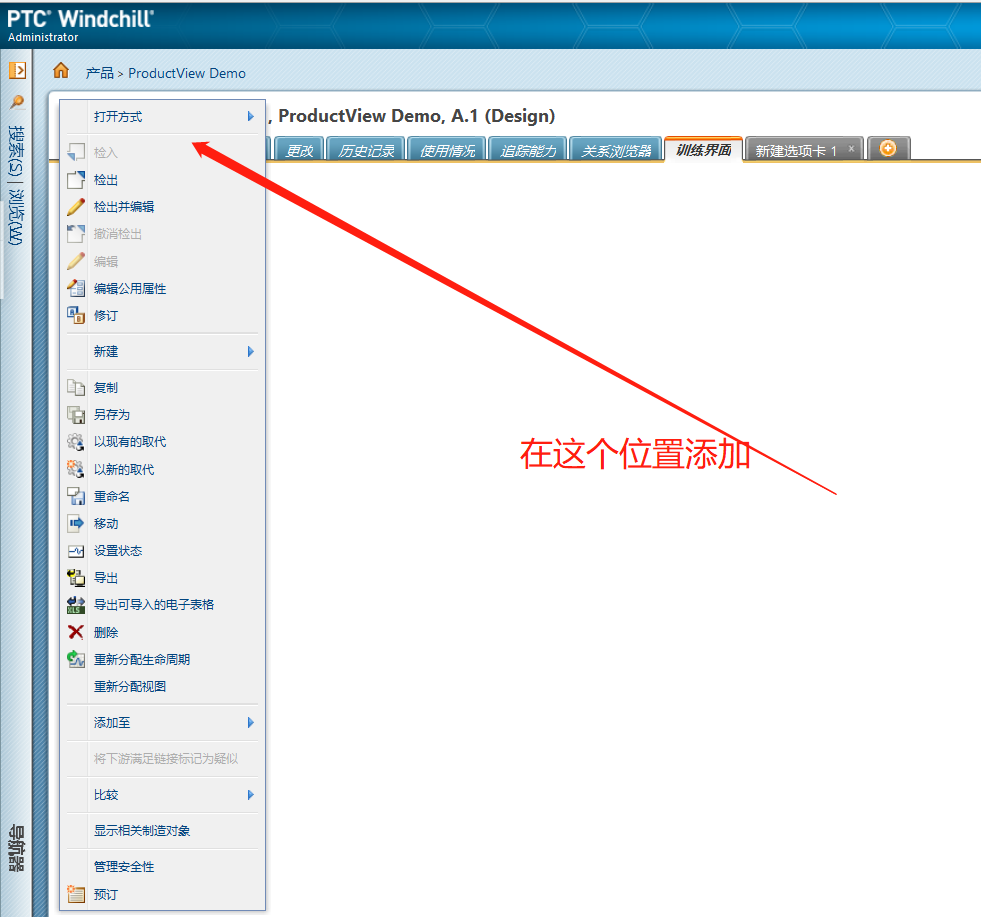

# 界面定制

## Action 下拉菜单定制

	

### custom-action.xml文件

```xml
<!--objecttype name="part" 表示part类型菜单-->
<objecttype name="selectColorType">
    //resourceBundle="资源文件的存放位置"
  <action name="ExportBom" renderType="GENERAL" ajax="page" resourceBundle="ext.ent.navigationRB">
    <command windowType="popup" class="java.lang.Object" 
		method="netmarkets/jsp/ext/fiberhome/report/report4/show_Archive_record.jsp?action=ExportBom"/>
  </action>
</objecttype>
```

### custom-actionModels.xml

```xml
<!-- Part information page Actions list -->
<model name="more parts actions" menufor="wt.part.WTPart"><action name="view" type="object"/><!-- View Information -->
<action name="separator" type="separator"/><!-- ===================================== -->
<submodel name="more parts toolbar actions open"/><action name="separator" type="separator"/><!-- ===================================== -->
    
<!-- 此处添加自己定制的model -->
<action name="selectColorName" type="selectColorType"/><!-- selectColor -->   
<!-- 此处添加自己定制的model -->    
    
<action name="checkin" type="wip"/><!-- Check In -->
<action name="WFCHECKIN" type="pdmObject"/><!-- Check In for new objects in workspace or objects checked out to workspace
--><action name="checkout" type="wip"/><!-- Check Out -->
<action name="WFRMBCHECKOUT" type="pdmObject"/><!-- checkout for rmb menu on workspace listing page -->
<action name="checkoutAndEdit" type="part"/><!-- Check Out and Edit -->
<action name="undocheckout" type="object"/><!-- Undo Checkout -->
<action name="WFCANCELCHECKOUT" type="pdmObject"/><!-- Undo Checkout for objects checked out to workspace
--><action name="edit" type="part"/><!-- Edit -->
<action name="editNewPartInWorkspace" type="part"/><!-- Edit newly created part in a workspace -->
<action name="editCheckedOutPartInWorkspace" type="part"/><!-- Edit part checked out to a workspace -->
<action name="editPartCommonAttrsWizard" type="part"/><!-- Edit Common Attributes -->
<action name="REVISEITEMS" type="pdmObject"/><!-- Revise -->
<action name="separator" type="separator"/><action name="fulfillChangeActions" type="effectivity"/><!-- FulfillChangeActions -->
<action name="undoFulfillDesignSolutionInfoPage" type="effectivity"/><!-- Undo Fulfill Change Action -->
<action name="GenerateChangeActions" type="effectivity"/><!-- Generate Change Actions for CI -->
<action name="displayEffectivityLog" type="effectivity"/><!-- Display Effectivity Log -->
<action name="separator" type="separator"/><!-- ===================================== -->
<submodel name="more parts toolbar actions new"/><!-- New ==> -->
<action name="separator" type="separator"/><!-- ===================================== -->
<action name="assignItemOptionality" type="optionality"/><!-- Assign Expression -->
<action name="viewAssignedExpression" type="expressionAssignable"/><!-- View Assign Expression -->
<action name="copyAssignedExpression" type="expressionAssignable"/><!-- Copy Independent Expression -->
<action name="configure" type="variantspec"/><!-- Configure -->
<action name="viewLogicBase" type="generic"/><!-- Show Logic -->
<action name="findVariants" type="variant"/><!-- Find Variants -->
<action name="separator" type="separator"/><!-- ===================================== -->
<action name="copy" type="object"/><!-- Copy -->
<action name="WFSAVEAS" type="pdmObject"/><!-- Save As -->
<action name="createSupersedeWithExistingWizard" type="supersede"/><!-- Supersede with Existing -->
<action name="createSupersedeWithNew" type="supersede"/><!-- Supersede with New -->
<action name="renameObjectWizard" type="object"/><!-- Rename -->
<action name="route" type="workflow"/><!-- Route -->
<action name="CONTAINERMOVE" type="pdmObject"/><!-- Move -->
<action name="SETSTATE" type="pdmObject"/><!-- Set State -->
<action name="EXPORT" type="pdmObject"/><!-- Export (PDMLink) -->
<action name="export" type="object"/><!-- Export (ProjectLink) -->
<action name="spreadsheetExport" type="ixb"/><!-- Export List to Importable Spreadsheet -->
<action name="MULTI_OBJ_DELETE" type="pdmObject"/><!-- Delete (Non-Information page) -->
<action name="MULTI_OBJ_DELETE_DETAILS" type="pdmObject"/><!-- Delete (Information page) -->
<action name="deleteIterations" type="object"/><!-- Delete Non-latest Iterations -->
<action name="reassignLC" type="lifecycle"/><!-- Reassign Life Cycle -->
<action name="resetTeam" type="team"/><!-- Reset Team -->
<action name="assignView" type="part"/><!-- Reassign View -->
<action name="publishToCAD" type="part"/><!-- Publish to CAD -->
<action name="separator" type="separator"/><!-- ===================================== -->
<action name="WFDOWNLOAD" type="epmdocument"/><!-- Add to Workspace -->
<submodel name="more parts toolbar actions add"/><!-- Add ==> -->
<action name="separator" type="separator"/><!-- ===================================== -->
<action name="SBSendToPdm" type="sandbox"/><!-- Send to PDM -->
<action name="sandboxCheckoutShare" type="object"/><!-- Convert to PDM Checkout -->
<action name="sandboxUndoCheckoutDetails" type="object"/><!-- Undo PDM Checkout (Information Page) -->
<action name="removeShare" type="object"/><!-- Remove Share -->
<action name="convertToShare" type="sandbox"/><!-- Convert to Share -->
<action name="updateShare" type="sandbox"/><!-- Update Selected Shares -->
<action name="separator" type="separator"/><!-- ===================================== -->
<action name="markLinkAsSuspect" type="requirement"/><!-- Mark Link As Suspect -->
<action name="separator" type="separator"/><!-- ===================================== -->
<action name="associateDistributionTarget" type="tgt"/><!-- ESI Associate distribution Targets (JCA action) -->
<action name="sendToDistributionTarget" type="tgt"/><!-- ESI Send to Distribution Target -->
<action name="erpInfo" type="esi"/><!-- ERP Part Details -->
<action name="viewShopOrdersInfo" type="esi"/><!-- ESI View Shop Order Count -->
<action name="separator" type="separator"/><!-- ===================================== -->
<submodel name="more parts actions compare"/><!-- Compare ==> -->
<action name="separator" type="separator"/><!-- ===================================== -->
<action name="batchPrint" type="wvs"/><!-- Severside batchprint using WVS -->
<action name="separator" type="separator"/><!-- ===================================== -->
<action name="DISPLAYRELATEDMANUFACTURINGITEMS" type="object"/><!-- MPMLink Display Related Manufacturing items report 
--><action name="separator" type="separator"/><!-- ===================================== -->
<!-- Add "Edit Localizable Properties (M020)-->
<!-- Edit Localizable Properties (M020)-->
<submodel name="wsl_submenu"/><action name="ManageSecurityMain" type="accessPermission"/><submodel name="object_manage_security_submenu"/><!-- Manage Security -->
<action name="createSubscription" type="subscription"/><!-- Subscribe --></
model>
```

```xml
	<objecttype name="navigation" class="" resourceBundle="com.gsdev.client.navigationRB">
		<action name="newTab" renderType="GENERAL">
			<command class="netmarkets" method="servlet/Navigation?tab=newTab" windowType="page"/>
		</action>
	</objecttype>
```

